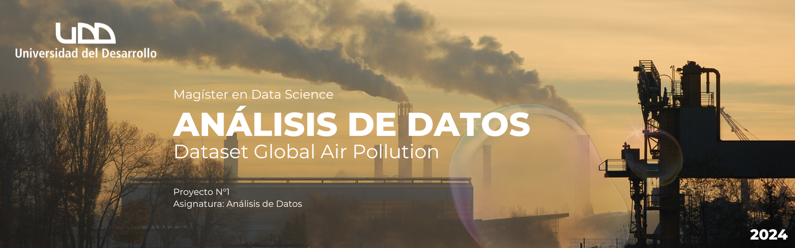

# Análisis de Datos del Dataset Global Air Pollution

<p align="left">
   
   
   



Este repositorio contiene un análisis de datos inicial del dataset  [Global Air Pollution][kaggle] de Kaggle, el cual mide los niveles de calidad del aire en distintas ciudades del mundo en función de varios contaminantes. El análisis está dividido en tres etapas, cada una implementada en un Jupyter Notebook: **Análisis Exploratorio**, **Limpieza de Datos**, y **Transformación de Datos**.

[kaggle]: https://www.kaggle.com/datasets/hasibalmuzdadid/global-air-pollution-dataset

## Descripción del Dataset

Este dataset incluye los valores de los principales contaminantes del aire:
- **CO AQI Value**: Índice de calidad del aire para monóxido de carbono.
- **Ozone AQI Value**: Índice de calidad del aire para ozono.
- **NO2 AQI Value**: Índice de calidad del aire para dióxido de nitrógeno.
- **PM2.5 AQI Value**: Índice de calidad del aire para partículas finas (PM2.5).
- **AQI Value**: Índice de calidad del aire general.
- **AQI Category**: Categoría que indica el nivel de contaminación del aire (Good, Moderate, Unhealthy, etc.).

El objetivo del análisis es identificar los contaminantes más importantes en diferentes ciudades, y preparar los datos para análisis futuros mediante procesos de limpieza, transformación, y visualización.

## Estructura del Repositorio

La estructura del proyecto es la siguiente:
```
global-air-pollution-analysis/
├── assets/                       # Carpeta que contiene imágenes o activos para el README
│   └── banner.png                # Imagen del banner utilizado en el README.md
├── data/                         # Carpeta que contiene los datasets originales y limpios
│   ├── global_air_pollution.csv  # Dataset original
│   └── dataset_clean.csv         # Dataset limpio generado tras la limpieza de datos
├── notebooks/                    # Notebooks de Jupyter con el análisis y transformación de datos
│   ├── 01_Analisis_Exploratorio.ipynb     # Análisis exploratorio de los datos
│   ├── 02_Limpieza_de_Datos.ipynb         # Limpieza de datos
│   └── 03_Transformacion_de_Datos.ipynb   # Transformación de datos (Ingeniería de características, normalización, estandarización)
├── README.md                     # Archivo de documentación del proyecto
```


### 1. **Análisis Exploratorio (`01_Analisis_Exploratorio.ipynb`)**

En este notebook, se realiza una exploración inicial del dataset:
- Carga y revisión del contenido del dataset.
- Exploración de las distribuciones de las variables numéricas mediante histogramas.
- Identificación de posibles relaciones entre variables numéricas con un mapa de calor de correlación.

### 2. **Limpieza de Datos (`02_Limpieza_de_Datos.ipynb`)**

Este notebook se enfoca en limpiar el dataset para prepararlo para un análisis en la etapa de Transformación de Daots:
- Eliminación de valores nulos.
- Relleno de datos faltantes en columnas clave (por ejemplo, se completa la columna "Country" con el valor más frecuente).
- Eliminación de duplicados.
- Verificación de los tipos de datos y corrección de formatos, si es necesario.

### 3. **Transformación de Datos (`03_Transformacion_de_Datos.ipynb`)**

En este notebook se aplican técnicas de transformación de datos:
- **Ingeniería de características**: Se crea una columna llamada `Dominant_Pollutant`, que identifica el contaminante con el valor de AQI más alto en cada fila.
- **Normalización**: Las variables numéricas se escalan para estar en el rango de 0 a 1 utilizando **Min-Max Scaling**.
- **Estandarización**: Las variables numéricas se transforman para tener una distribución con media 0 y desviación estándar 1, utilizando **StandardScaler**.

Además, este notebook incluye visualizaciones que comparan las distribuciones antes y después de la normalización y estandarización mediante histogramas y boxplots.

## Visualizaciones Clave

A lo largo del análisis, se generaron diversas visualizaciones para facilitar la comprensión de los datos:

- **Histogramas**: Para observar la distribución de las variables numéricas antes y después de las transformaciones.

## Requisitos

Para ejecutar los notebooks y replicar el análisis, necesitas instalar las siguientes dependencias:

`pip install numpy pandas matplotlib seaborn scikit-learn`